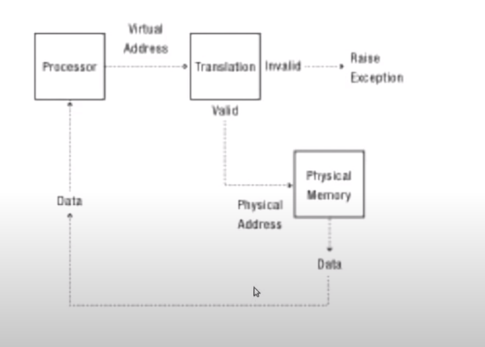
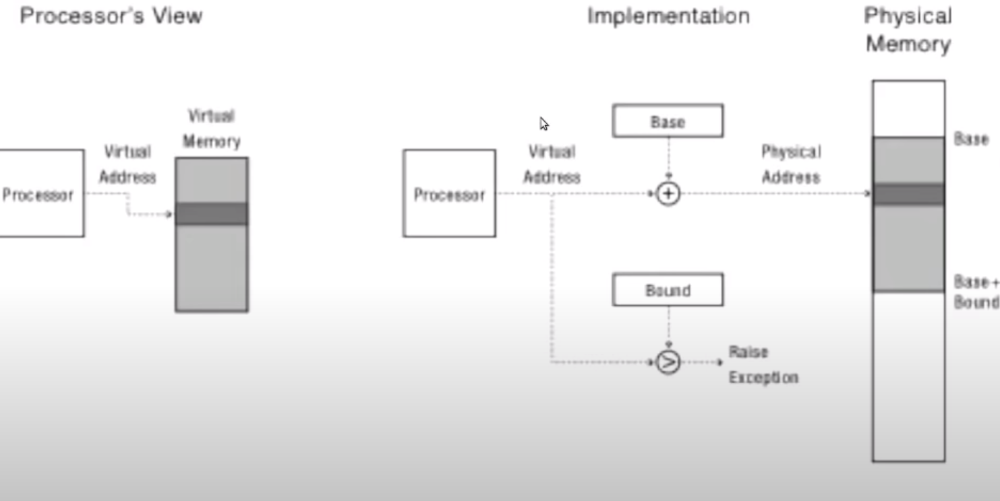

# Address translation concept

### The goals of address translation

* Memory protection
* Memory sharing
  * shared libraries, interprocess communication
* Sparse addresses
  * Multiple regions of dynamic allocation\(heaps/stacks\)
* Efficiency
  * Memory placement
  * Runtime lookup
  * Compact translation tables
* portability

### Virtually addressed base and bounds

Each process gets a base and bound register. When a

